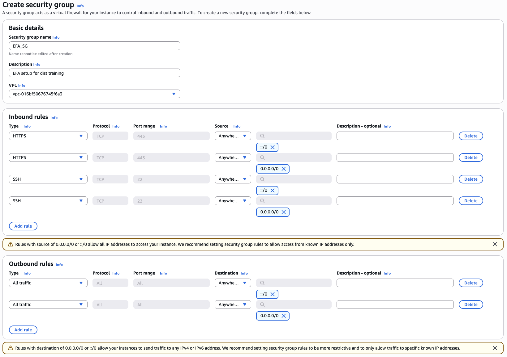
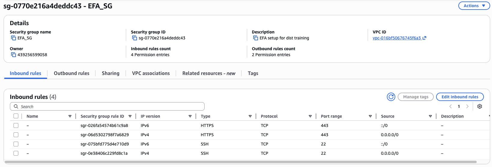
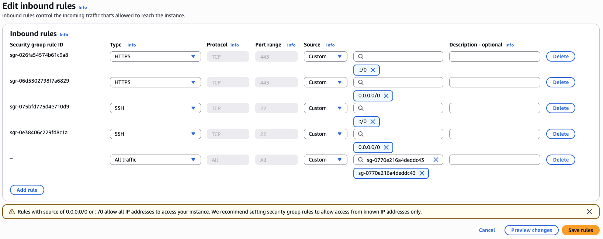
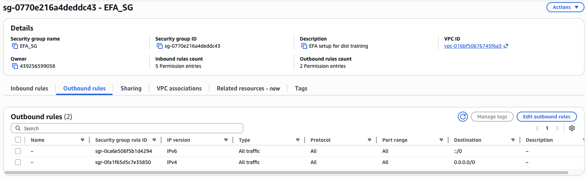
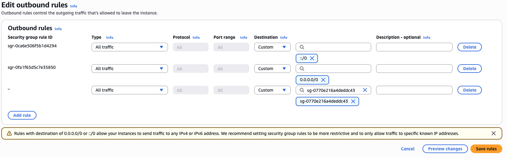
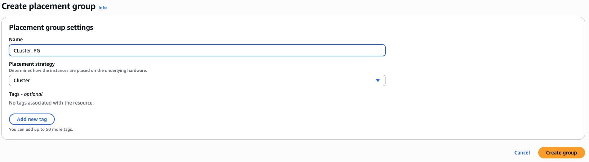

# Setup Security Groups and Placement Groups for multi-node training

This chapter will guide you through the process of setting up security groups and cluster placement groups for your EC2 instances. Security groups act as virtual firewalls that control the inbound and outbound traffic to your instances, while cluster placement groups help ensure that your instances are placed in a way that optimizes network performance for distributed training.

In subsequent chapters we will run you through the process of modifying EC2 launch templates to enable EFA and maximize network bandwidth, but in this chapter we will focus on the security group and placement group setup itself.

## Steps

**Step 1:** Open the EC2 console and navigate to the "Security Groups" section. Click on "Create Security Group" to create a new security group for your instances. Now create a basic configuration for the security group, allowing inbound SSH access (port 22) and HTTP access (port 80) and enabling all outbound traffic. You can customize the security group rules based on your specific requirements.

**Step 2:** With the security group created, we can now set up the self-referential rules that will allow the EC2 instances to communicate with each other over the network. This is important for distributed training, as the instances will need to exchange data and coordinate their actions. To do this, edit the inbound rules of the security group and add a new rule that allows all traffic (or specific ports if you want to restrict it) from the security group itself. This means that any instance associated with this security group will be able to communicate with any other instance in the same security group.

To this end, we select the "Edit inbound rules" option for the security group we just created, and add a new rule allowing all traffic from the security group itself. This is done by selecting "Custom" for the type, "All traffic" for the protocol, and then selecting the security group from the "Source" dropdown menu.

Similarly, we also need to edit the outbound rules of the security group to allow all traffic to the security group itself. This is done by selecting "Edit outbound rules" and adding a new rule that allows all traffic to the security group. This is done by selecting "Custom" for the type, "All traffic" for the protocol,and then selecting the security group from the "Destination" dropdown menu.

**Step 3:** With the security group set up, we can now create a cluster placement group. Cluster placement groups are a logical grouping of instances within a single Availability Zone that enables applications to participate in a low-latency, high-bandwidth network. This is particularly beneficial for distributed training workloads, as it can significantly improve the communication performance between instances.

Placement groups are versatile and can be used with different instance types, can can be leveraged for improving resilience od deployed fleets of instances by spreading them across different underlying hardware groupings. However, for the purpose of this tutorial, we will be creating a cluster placement group, which is specifically designed to optimize network performance for distributed training workloads. To create a cluster placement group, navigate to the "Placement Groups" section in the EC2 console and click on "Create Placement Group". Provide a name for the placement group and select "Cluster".

