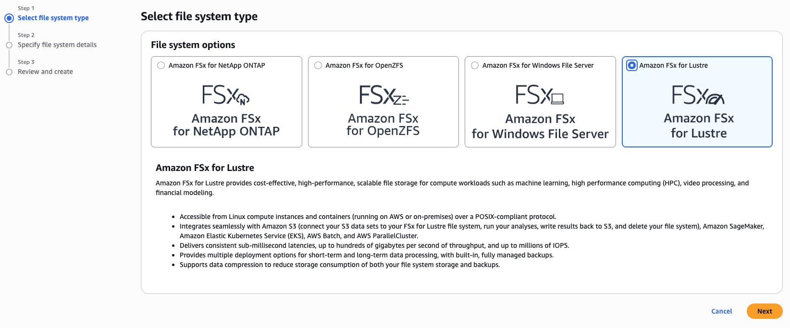
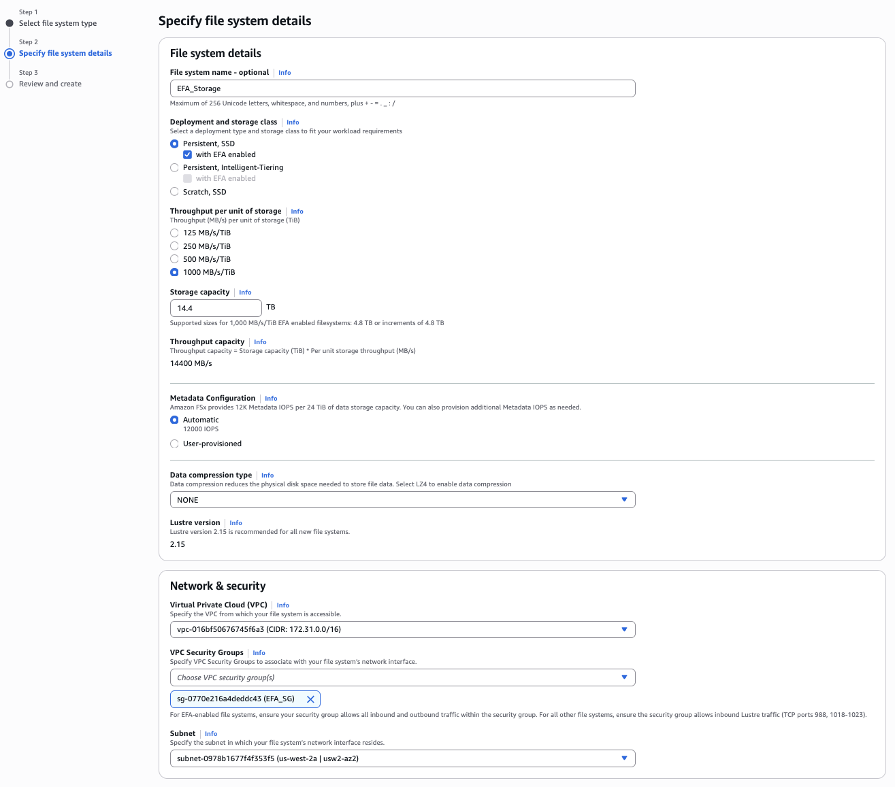

# Setup FSX for Lustre Storage

This chapter will guide you through the process of setting up FSX for Lustre storage on AWS. FSX for Lustre is a high-performance file system that is optimized for compute-intensive workloads, making it an ideal choice for usage as a shared storage solution for distributed training workloads. By following the steps outlined in this chapter, you will be able to create and configure an FSX for Lustre file system that can be used by your EC2 instances for storing and accessing training data and model checkpoints via the EFA network interface.

## Steps

**Step 1:** Open the FSX console and click on "Create file system". Select "Lustre" as the file system type and choose the appropriate configuration options based on your requirements. This includes selecting the storage capacity, performance mode, and throughput capacity for your file system. You can also choose to enable encryption for your file system if desired.

**Step 2:** In the configuration options, make sure to select the same VPC and availability zone as your EC2 instances to ensure that they can access the file system. Ensure that you select the EFA option for the network interface, which will allow your EC2 instances to access the FSX file system using EFA for high-performance data transfer.

Also make sure to select the security group that you created in the previous chapter, which has the appropriate rules to allow communication between the EC2 instances and the FSX file system using EFA.

The rest of the configuration options can be set based on your specific requirements and use case. For example, you can choose the storage capacity and performance mode based on the size of your training data and the expected I/O workload. You can also choose to enable encryption for your file system if you want to ensure that your data is secure. They can also be left at their default values if they are sufficient for your needs.
