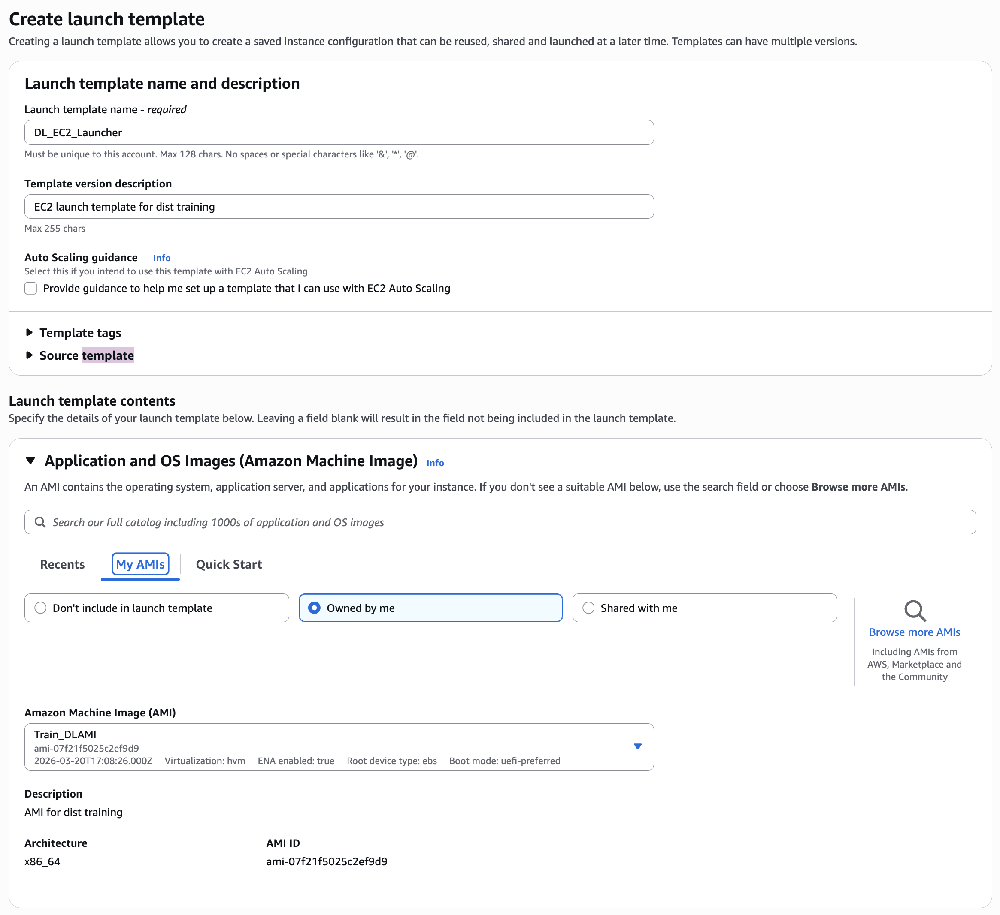
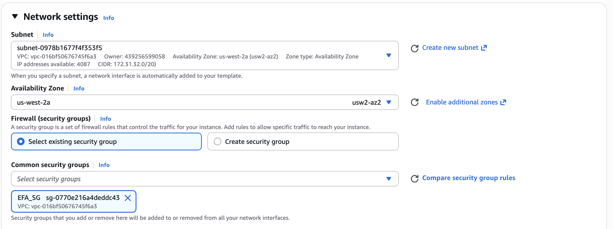
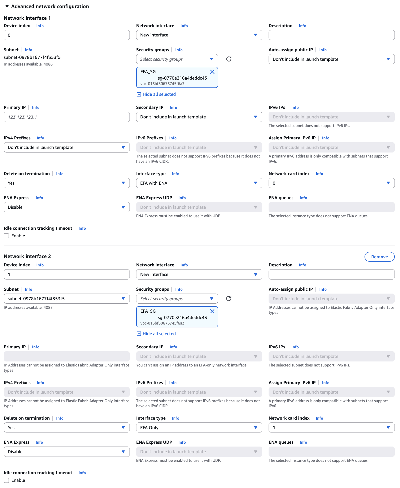
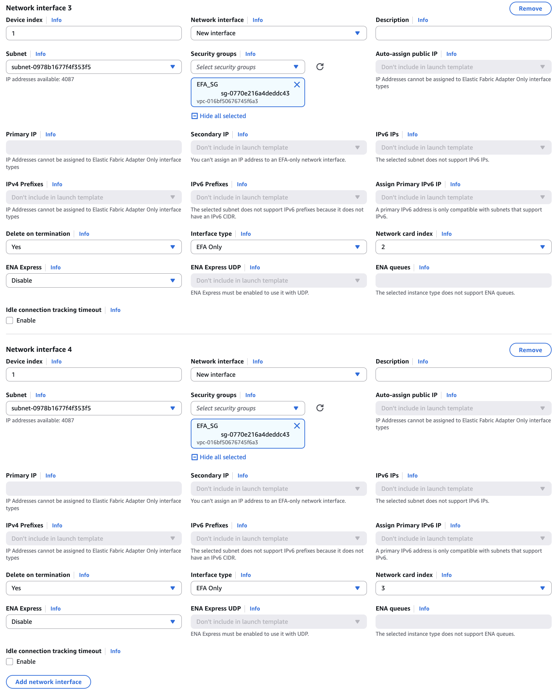
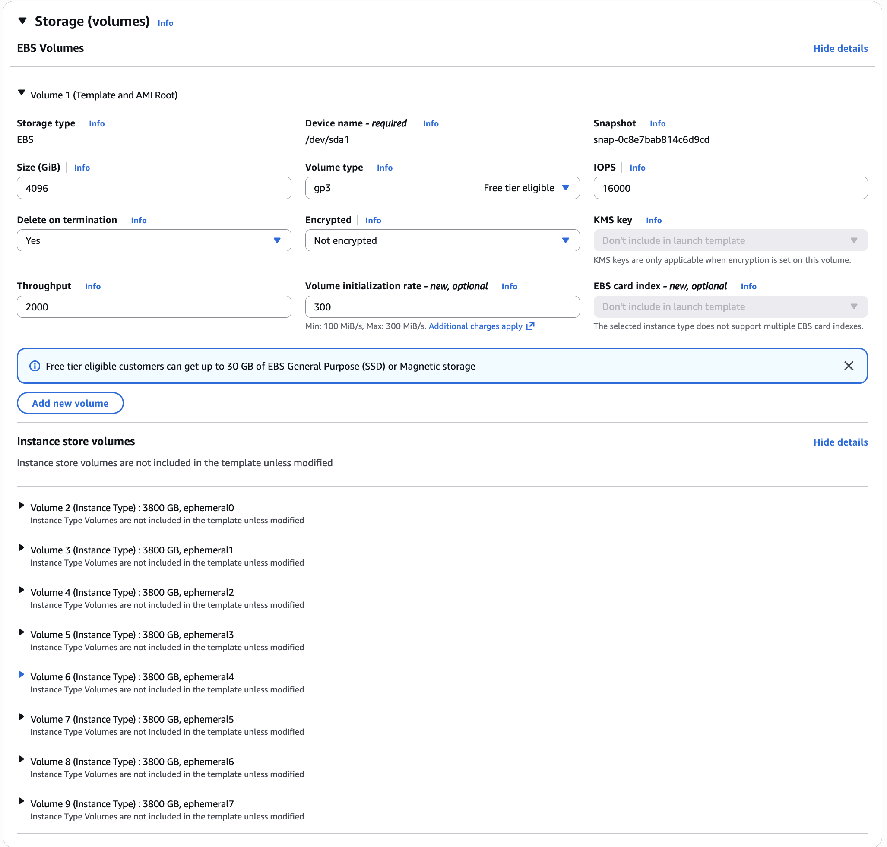
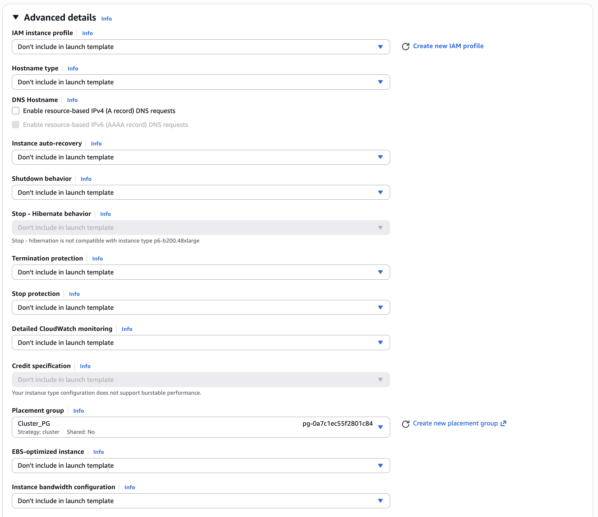
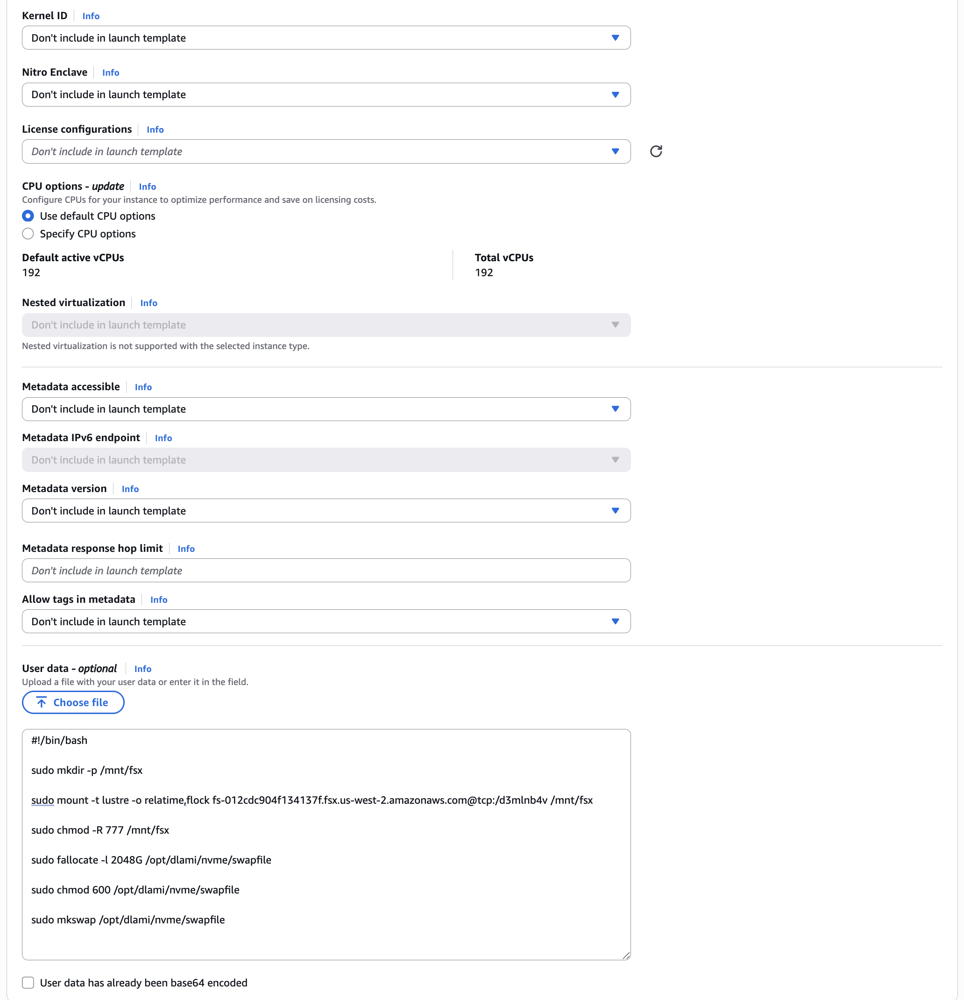
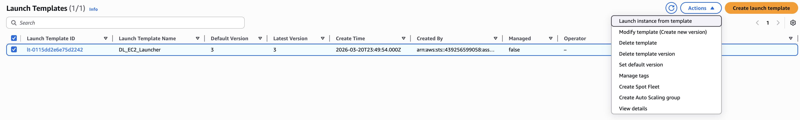

# Create Optimized EC2 Launch Template for Multi-node Training

In this chapter, we will create an EC2 launch template that is optimized for multi-node training workloads. This involves configuring the launch template to maximize network bandwidth, creating a swap partition on the NvMe instance storage (useful when loading large models and datasets), and mounting the FSX for Lustre storage to the instances. By creating a launch template with these optimizations, we can ensure that any instances launched using this template will be configured correctly and repeatably for our training workloads, saving time and effort in the future.

## Steps

**Step 1:** Create a new EC2 launch template. Go to the EC2 console, click on "Launch Templates" in the left-hand menu, and then click on "Create launch template". Provide a name and description for the launch template, and select the AMI that you created in the previous chapter (or any other AMI that you prefer). Choose an instance type that is suitable for your training workloads (e.g., p4d or p5 for large-scale training).



**Step 2:** Configure the correct high-level subnet and security group settings for the launch template based on what we configured in the previous chapters. This is important to ensure that the instances launched using this template can communicate with each other and with other AWS services as needed.



**Step 3:** In the "Advanced network configuration" section inside network settings, add settings for multiple network cards to maximize network bandwidth for multi-node training and for communication with the FSX for Lustre storage. This is an involved step where a large number of bespoke configurations are plausible, but for simplicity we will add 4 network cards in total, with first network card configured with an EFA with ENA setup and the other 3 network cards configured with EFA only. You must make sure that the security groups and the subnet you select in these steps are consistent with the ones you created in the previous chapters.

In this setup only the first network card can be assigned an IP address, and the other 3 network cards will be used for EFA communication only. This is a common setup for multi-node training workloads where the first network card is used for general communication and the other network cards are used for high-speed communication between instances using EFA. For other possible setups and configurations, please refer to the AWS documentation on [Maximizing EFA bandwidth](https://docs.aws.amazon.com/AWSEC2/latest/UserGuide/efa-acc-inst-types.html).





**Step 4:** In the "Storage (volumes)" section, configure the EBS volumes for the launch template. Make sure to set the bandwith and IOPS settings to an appropriate level for your training workloads. You can also add additional EBS volumes if needed for your training data or model checkpoints. However, our training setup will mainly rely on the FSX for Lustre storage for training data and model checkpoints, so we will not add additional EBS volumes in this step.

It is important to note the "Instance store (ephemeral)" section in the storage configuration. This section allows you to configure the instance store volumes that are physically attached to the instance. For certain instance types (e.g., p4d and p5), these instance store volumes are NvMe drives that can provide very high bandwidth and low latency storage, which can be beneficial for training workloads that require fast access to data. Thse can be used as a "scratch" storage for training workloads, where intermediateky processed versions of the training data can be stored for fast access during training.

We will leverage this fast storage as a swap partition for our training workloads, which can be beneficial when loading large models and datasets that may not fit entirely in memory. To do this, we will create a swap file on the instance store volumes and configure the system to use it as swap space during training. This can help prevent out-of-memory errors and improve the overall performance of the training workloads.



**Step 5:** In the "Advanced details" section, setup the cluster placement group settings for the launch template. This is important to ensure that the instances launched using this template are placed in the same cluster placement group, which can help improve network performance for multi-node training workloads. Select the cluster placement group that you created in the previous chapters.



**Step 6:** In the "Advanced details" section, add user data scripts to the launch template to automate the setup of the instances when they are launched. This can include commands to create a swap file on the instance store volumes and configure the system to use it as swap space, as well as commands to mount the FSX for Lustre storage to the instances.



Below is our example of a user data script that performs these tasks. You can customize this script as needed for your specific training workloads and setup.

```bash

#!/bin/bash

sudo mkdir -p /mnt/fsx
sudo mount -t lustre -o relatime,flock fs-012cdc904f134137f.fsx.us-west-2.amazonaws.com@tcp:/d3mlnb4v /mnt/fsx
sudo chmod -R 777 /mnt/fsx

sudo fallocate -l 8192G /opt/dlami/nvme/swapfile
sudo chmod 600 /opt/dlami/nvme/swapfile
sudo mkswap /opt/dlami/nvme/swapfile
sudo swapon /opt/dlami/nvme/swapfile
sudo sysctl vm.swappiness=1
sudo mkdir -p /opt/dlami/nvme/shm
sudo chmod 777 /opt/dlami/nvme/shm
```

**Step 7:** Review all the settings for the launch template and make sure they are correct. Once you are satisfied with the configuration, click on "Create launch template" to create the launch template. Now this launch template can be used to launch EC2 instances that are optimized for multi-node training workloads, with the correct network configuration, storage setup, and automated instance initialization. You can launch multiple instances at a time using this launch template, and they will all be configured correctly for your training workloads, saving you time and effort in the future. We will launch two instances this way for our reward model training in the next chapter.



