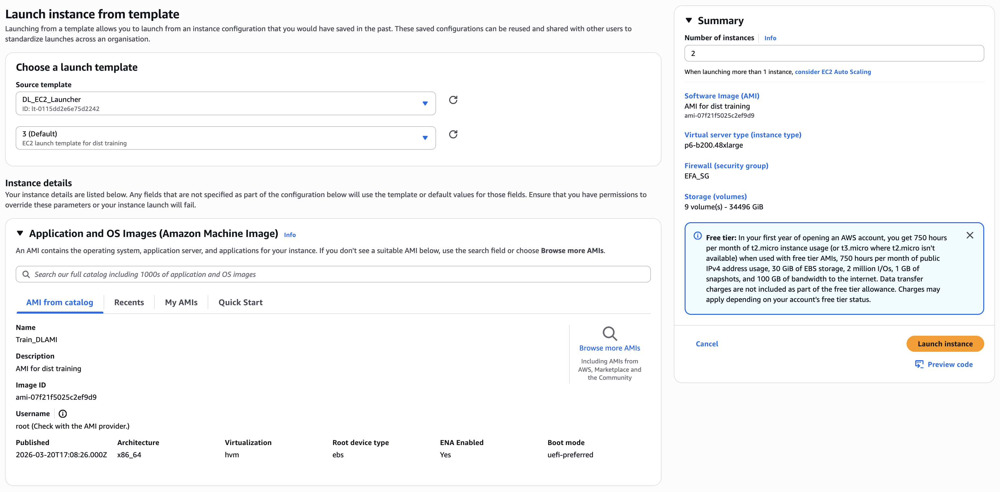
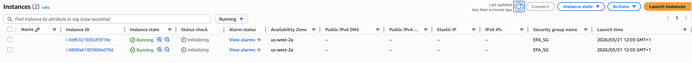
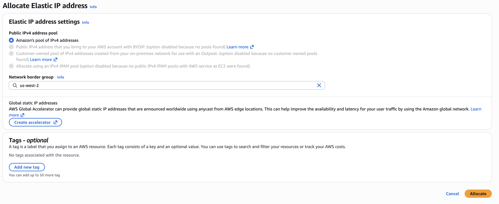
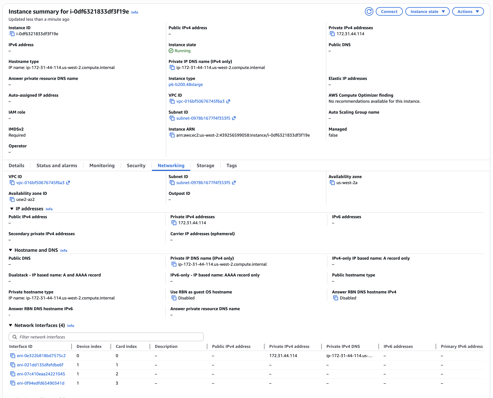
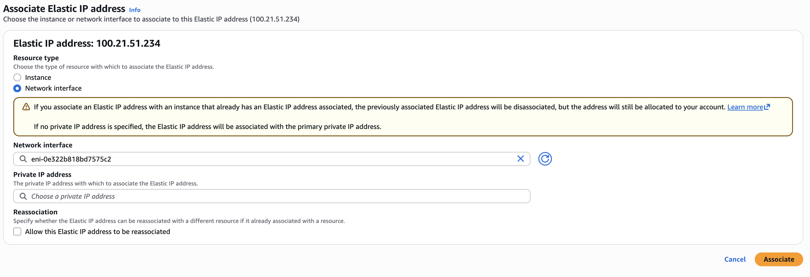

# Launch multiple EC2 instances for multi-node training and assign public IPs

In this chapter, we will launch multiple EC2 instances using the optimized launch template that we created in the previous chapter. We will also assign public IP addresses to these instances to enable SSH access and communication with other AWS services as needed. This step gets us ready to start the multi-node training process in the next chapter, where we will test the EFA and FSX storage setup and initiate distributed training using the instances that we launched in this chapter.

## Steps

**Step 1:** Review all the settings for the launch template and make sure they are correct. Once you are satisfied with the configuration, click on "Create launch template" to create the launch template. Now this launch template can be used to launch EC2 instances that are optimized for multi-node training workloads, with the correct network configuration, storage setup, and automated instance initialization. You can launch multiple instances at a time using this launch template, and they will all be configured correctly for your training workloads, saving you time and effort in the future. We will launch two instances this way for our reward model training in the next chapter.

The result should be that you have multiple EC2 instances launched and running, with the correct network and storage configuration for multi-node training workloads. You can verify this by going to the EC2 console and checking the instances that you launched using the launch template. You should see that they are in the "running" state, and that they have the correct instance type, network configuration, and storage setup as defined in the launch template.

**Step2:** After you have launched the instances using the launch template, navigate to the "Elastic IPs" section in the EC2 console and allocate new Elastic IP addresses. We will allocate one Elastic IP address for each instance that we launched in the previous step.

**Step 3:** After you have allocated the Elastic IP addresses, you need to associate each Elastic IP address with the corresponding EC2 instance that you launched in th previous step. To do this, select the Elastic IP address that you want to associate, click on "Actions", and then click on "Associate Elastic IP address".

It is important to note that the usual practive of allocating Elastic IP addresses and associating them with EC2 instances is only possible when the instance has a single ENA-enabled network card. In our setup, we have multiple network cards with only one of them being ENA-enabled, so we need to make sure to associate the Elastic IP address with the correct network card (i.e., the one that is ENA-enabled) rather than the instance itself.

To get the ENA-enabled network card, you can click on the instance ID in the EC2 console, navigate to the "Networking" tab, and identify the network card that is ENA-enabled. The ENA-enabled network card will bhave device index 0 (as we configured in the launch template), and it will be the only network card that has a private IP address assigned to it. Select the interface ID of this network card when associating the public Elastic IP address.

It is worth pointing out that such a public-ip-per-instance setup is not strictly necessary for multi-node training workloads, as more conventionally for large teams and production setups, instances may be launched in a private subnet using a cloud cluster setup and then accessed through a bastion host (common known as headnode). In such setups only the bastion host (typically only a CPU instance) will have a public IP address, and the other instances will be in a private subnet without public IP addresses. This can be a more secure and cost-effective setup for multi-node training workloads, as it limits the exposure of the instances to the public internet and allows for better control over access to the instances. However, for the purpose of this tutorial and for simplicity, we will assign public IP addresses to our instances to enable direct SSH access and communication with other AWS services as needed. For more information about alternative infrastructure setups for multi-node training workloads, please refer to the documentation on [AWS ParallelCluster](https://github.com/awslabs/awsome-distributed-training/tree/main/1.architectures/2.aws-parallelcluster) and [Sagemaker Hyperpod](https://github.com/awslabs/awsome-distributed-training/tree/main/1.architectures/5.sagemaker-hyperpod).
